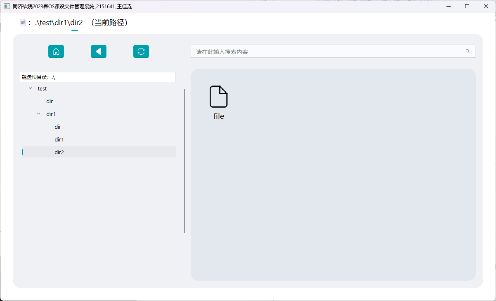
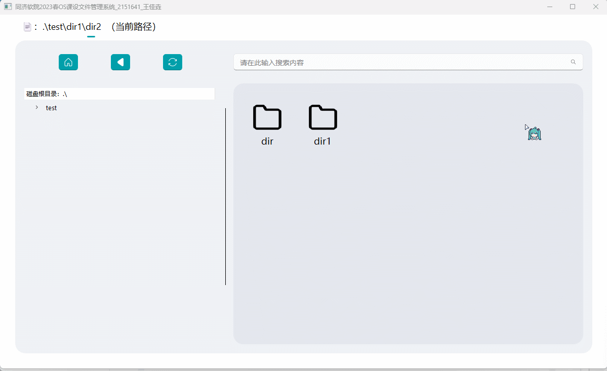
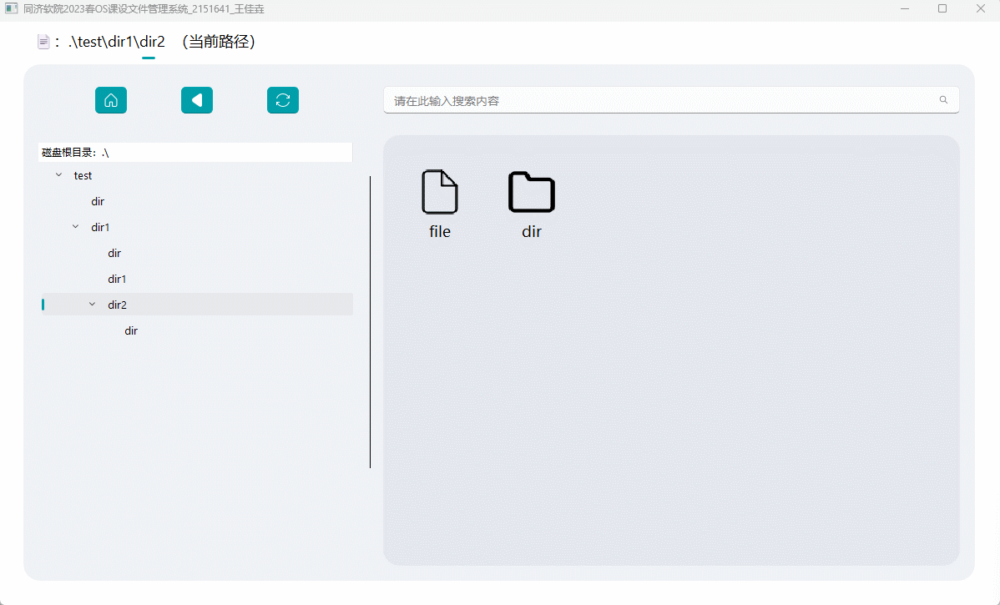
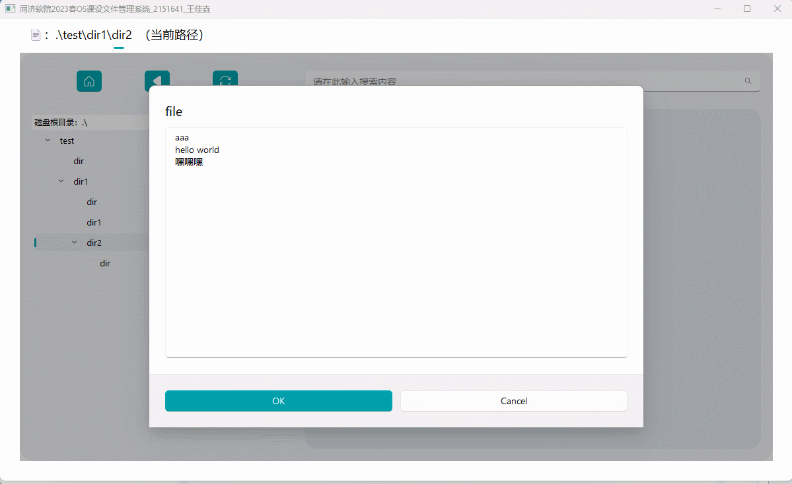
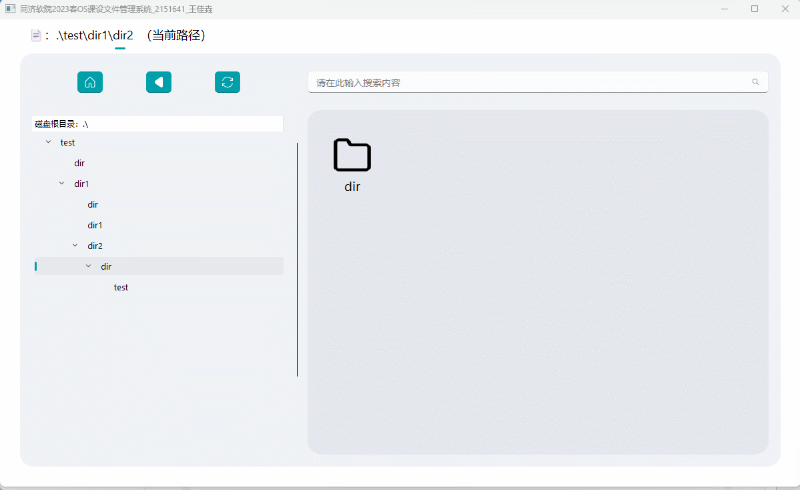
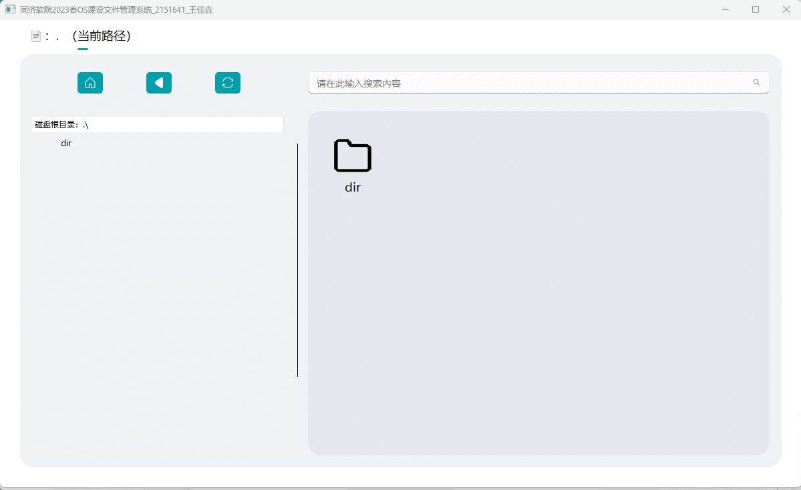
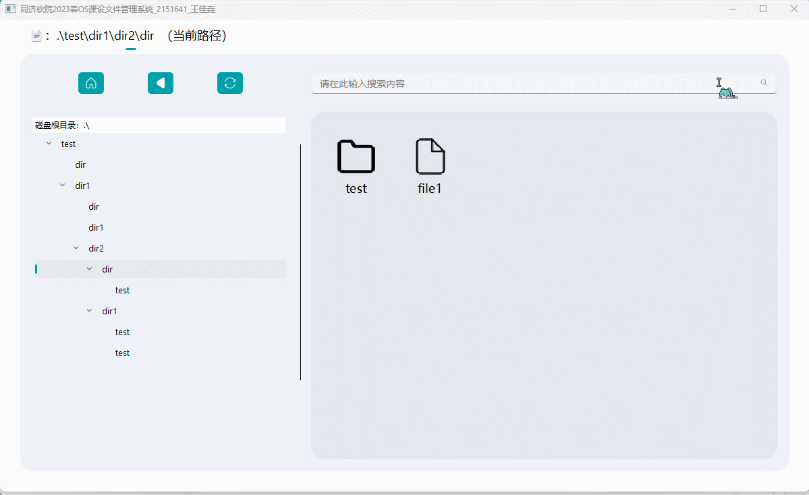
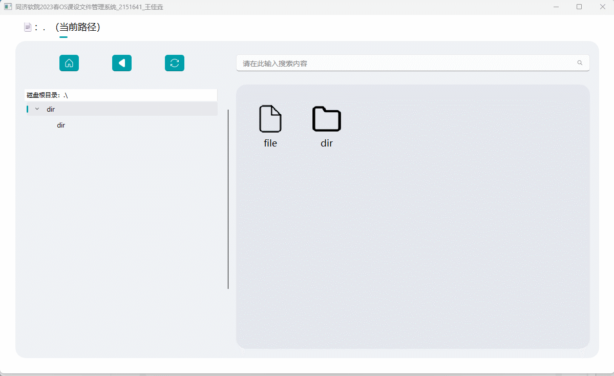
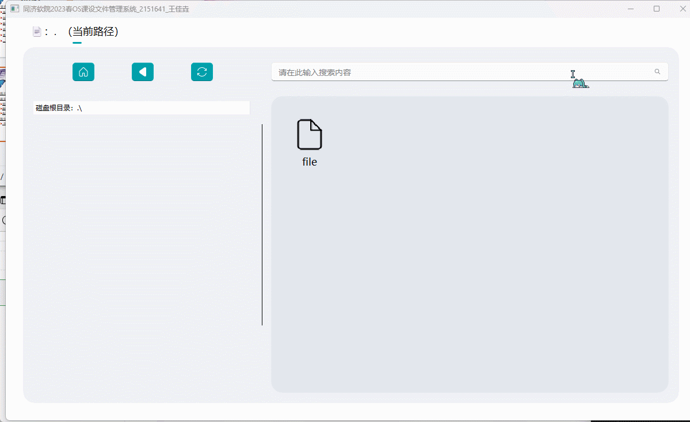
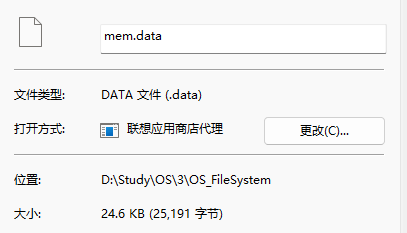

> REPORT is here : https://momoyamasawa.notion.site/REPORT-1dfaf8e1ab3f44a7bd0ac198fa9d56f8?pvs=4

# 项目简介

本项目为同济大学软件学院2023春操作系统课程项目的文件管理系统模拟。


# 项目功能 & 实现介绍



- 在内存中开辟一个空间作为文件存储器，在其上实现一个简单的文件系统，其中块大小设置为512字节，一共有48个块
- 退出这个文件系统时，该文件系统的内容可以保存到磁盘上，下次可以将其回复到内存中来。
- 文件物理结构采用索引结构
- 文件目录结构采取树形结构，因为目录内容少，所以只使用了单级目录
- 因为文件管理系统较简单且设定大小较小，空闲空间管理采用位图
- 文件系统提供格式化功能，创建/删除/复制/粘贴/剪切/显示/更改/查看详情目录功能，创建/删除/打开/关闭/复制/粘贴/剪切/读/写/改名/查看详情文件功能，通过左侧树状目录直接跳转到指定目录功能，显示存储空间占用位视图功能

# 功能演示

> 右键是菜单，双击可以直接打开，左上角显示的是当前所在目录，右边的框框是当前所在目录底下的目录项，三个按钮分别是回到主页，返回上一级和格式化，左侧树形结构只显示了目录，可以单击快捷到指定目录，也可以双击打开/关闭折叠（注意左侧树形结构目录的选中项并不代表当前在这个选中项目录，要看左上角的路径）


- **查看位视图情况**

  

- **编辑文件**（双击也可以打开）

  

- **改名**

  

- **文件夹切换**（按钮可以回到上一级和回到根目录，然后左侧树形结构可以单击进入指定目录，树形结构中只显示了目录然后双击是展开，还可以双击打开文件夹进入该文件夹，左上角有当前路径的显示）

  

- **新建删除复制粘贴剪切**

  

- **查看文件/目录详情**

  

- **格式化**

  

- **空间不足提示**（设置了块大小只有2，也就是只存了位视图和索引文件）

  

- **存储占用磁盘空间**：存到磁盘上的理论空间为 48*512B = 24KB，转换成指定的python字节数组类模拟空间还需要一定的额外信息，可能还有一些其他杂七杂八的环境信息，最后磁盘上空间占用为24.6KB



# 运行代码

在项目根目录 `.\OS_FileSystem`

```
pip install -r requirements. txt
```

在[zhiyiYo/PyQt-Fluent-Widgets at PyQt6 (github.com)](https://github.com/zhiyiYo/PyQt-Fluent-Widgets/tree/PyQt6)安装PyQt6-Fluent-Widgets包的pyqt6版本==0.9.1

然后运行:

```
python main.py
```


# 项目总结

## 项目亮点

- 页面美观，动画流畅，加上有位图显示占用情况，便于观察
- 底层完全模拟比特和位的存储，模拟深入，而且有容错措施
- 提示信息清晰，和传统文件系统操作类似，使用便利
- 代码架构较好

## 项目改进方向

- 项目参数（块大小等）暂时没做自定义功能
- 暂无撤回上一步操作的功能，可以做一个状态机，没时间做了
- 暂无文件搜索和文件排序功能，本来打算试试哈希值来搜索文件的，没时间做了
- 暂无多开文件夹和多开文件的操作，考虑到要维护一张使用表，可以采用类似目录协议的方法保证有其他人在读的时候不可写入或者写入后更新正在读的人的内容？没时间做了
